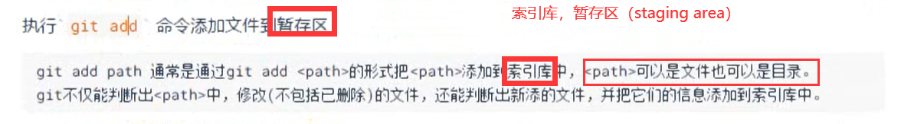
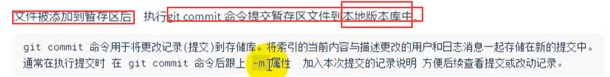
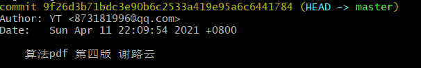
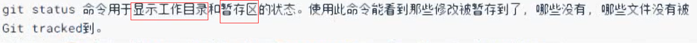

## 修改支持中文编码utf -8

1. git config --global core.quotepath false
2. Options->Text->Local改为zh_CN，Character set改为UTF-8

## 清屏

### clear

# 版本回退

## 版本回退的本质

git将每次的提交都给备份下来

## 回退到上几个版本 

### git reset --hard HEAD~x

~x表示回退x个版本

## 回退到固定的版本

### git reset --hard xxxx（识别版本的一串字符）

## 显示提交的版本记录

### git reflog

就可以看到以往的版本记录

# 文件操作

## 将文件传到本地git仓库

这个很像我们的obs架构的的p层（文件），index层（暂存区），以及service层（本地git仓库）

### 1.git add 文件 

### 2.git commit -m '备注'

## 组合命令add并commit

### git commit -a

## 打印commit的相关版本信息

### git log

 下面的文字是git commit-m 后添加的备注

## 查看本地工作区和暂存区状态

### git status

## 将暂存区中的文件撤销

### git reset HEAD 文件

## 工作目录的文件与在git版本库的文件比较不同

### git diff HEAD -- XXX

---代表git版本库中的

+++代表工作目录中的

## 文件从本地以及git仓库删除

文件删除的本质还是文件的修改

所以文件的删除的操作可以按照前面文件的添加操作一样提交到git仓库

### git add xxx   git commit xxx

这里的xxx可以是本地工作目录中刚被删除的文件

也可以通过:

### git rm xxx

该操作会把本地工作目录以及git仓库里面的xxx文件都给删除

## 将删除的文件从git仓库恢复

### git checkout xxx

# 简单的git介绍

git是一个dvcs，远程仓库有github，gitee等等。务必区别二者。

# 管理仓库

## 查看本地仓库中的文件 

### git ls-files

## 绑定远程仓库并起别名

### git remote add 别名 地址

别名一般是origin（指的是本地仓库的别名，所以用origin源头代指）

remote远程，将本地的仓库添加（add）到远程的仓库中去

## 将本地仓库推送到远程仓库

### 用https来推送

#### git push -u 仓库的别名 master  https的内容

### 用ssh来推送（好处就是无需输入账号密码）

#### git push -u 仓库的别名 master 

用`git push`命令，实际上是把当前分支`master`推送到远程

由于远程库是空的，我们第一次推送`master`分支时，加上了`-u`参数，Git不但会把本地的`master`分支内容推送的远程新的`master`分支，还会把本地的`master`分支和远程的`master`分支关联起来，在以后的推送或者拉取时就可以简化命令。（上下两段文字来源：https://www.liaoxuefeng.com/wiki/896043488029600/898732864121440）

#### ssh的配置使用

##### ssh-keygen -t rsa -c "账号"

三下回车后在C:\Users\Administrator\\.ssh打开id_rsa.pub后复制内容，进入远程仓库设置ssh

# 分支

开发企业项目中在使用Git或者其他类似版本控制软件对项目版本进行管理时,多人合作的项目在开发时通常不
会直接在主干 master上进行操作,而是重新开辟新的分支,在新的分支上进行开发调试等操作,当项目调试通过
时才会将分支项目的代码合并到主干中,这是在实战中比较好的一种策略,特别是多人协同开发一个项目的情况下
尤其明显。

## 本地：切换并创建分支

### git checkout -b 分支名

## 本地：切换分支

	### git checkout 分支名

## 本地：重命名分支

### git branch -m或者-M 旧分支名 新分支名

## 本地：删除分支

git branch -d 分支名

## 本地：合入分支

首先需要切换到master分支，因为是master分支合入其他分支。然后再试本地的master push到远程的master。

### git merge 分支名

## 查看所有分支

### git branch -a

## 推送本地分支到远程

### git push 本地仓库名 分支名 : 远程分支名

并不需要进入master分支才能推送，分支名与远程名一致就可以省略远程分支名

## 删除远程分支但是本地分支依旧还在

### git push 本地仓库名: 远程分支名

## 拉取远程分支到本地

### git checkout -b 远程分支名 本地仓库名/本地分支名

远程分支名与本地分支名应该名字一样

# 解决冲突

## 本地自己手动解决

## 多人先拉取后推送

# 可能出现的小问题

##  1.git push -u origin mastererror: src refspec master does not match any
error: failed to push some refs to 
本地的版本可能没有提交到本地的git仓库中，使用add和commit一下